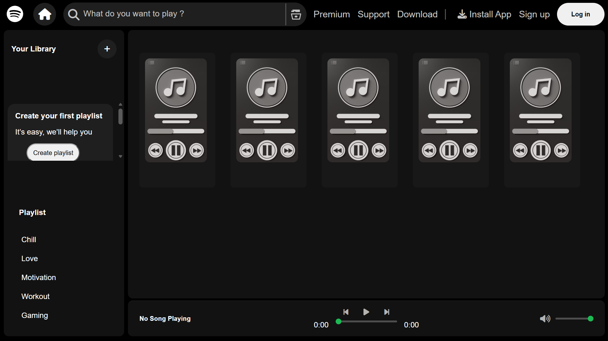
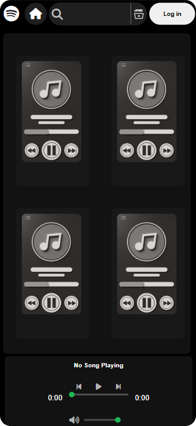
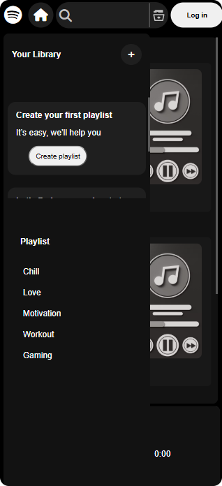

# 🎵 Spotify Clone

A fully functional, responsive, and modern Spotify-inspired music player built using **HTML, CSS, and JavaScript**.

This project allows users to switch playlists, play songs, control playback, seek through tracks, adjust volume, and enjoy a clean Spotify-like interface on both desktop and mobile devices.

---

## 📸 Preview

### 🖥️ Desktop View

<p align="center">

</p>

---

### 📱 Mobile View

<p align="center">


</p>

---

## 🎥 Demo Video

https://github.com/user-attachments/assets/ef184529-bb05-452d-8a9f-d501229812f4

---

# ✨ Features

- 🎵 Dynamic Playlist Switching
- ▶️ Play / Pause Music
- ⏮ Previous Song
- ⏭ Next Song
- 🎚 Interactive Seek Bar
- 🔊 Volume Control
- 🔇 Mute / Unmute
- 🎧 Current Song Display
- 📂 Songs Loaded Dynamically
- 📱 Fully Responsive Design
- 🎨 Spotify Inspired Dark UI

---

# 🛠 Tech Stack

| Technology | Usage |
|------------|-------|
| HTML5 | Structure |
| CSS3 | Styling & Responsive Design |
| JavaScript (ES6) | Application Logic |
| Font Awesome | Icons |
| Fetch API | Loading Songs |

---

# 📂 Folder Structure

```text
Spotify/
│
├── preview/
│   ├── screen-recording/
│   │   └── video.mp4
│   │
│   └── screenshots/
│       ├── desktop.png
│       └── phone-view/
│           ├── image1.png
│           └── image2.png
│
├── songs/
│   ├── Chill/
│   ├── Gaming/
│   ├── Love/
│   ├── Motivation/
│   └── Workout/
│
├── favicon.ico
├── Music_Cover.png
├── index.html
├── style.css
├── script.js
└── README.md
```

---

# 🚀 Getting Started

Clone the repository

```bash
git clone https://github.com/your-username/spotify-clone.git
```

Open the project folder

```bash
cd spotify-clone
```

Run the project using **Live Server** in Visual Studio Code.

---

# 🎮 How to Use

- Select a playlist from the left panel.
- Click any music card to start playback.
- Use Play / Pause controls.
- Skip to the Previous or Next song.
- Drag the seek bar to change playback position.
- Adjust the volume using the volume slider.
- Enjoy the responsive interface on desktop and mobile.

---

# 📚 What I Learned

- DOM Manipulation
- Event Handling
- JavaScript Audio API
- Fetch API
- Dynamic Content Rendering
- Responsive Web Design
- CSS Flexbox
- Media Queries
- Project Structuring
- Debugging Real-world JavaScript

---

# 👨‍💻 Author

**Om Aggarwal**

If you enjoyed this project, feel free to ⭐ the repository.

---

<p align="center">

### ⭐ Thanks for visiting my project ⭐

**Keep Learning • Keep Building • Keep Growing 🚀**

</p>
